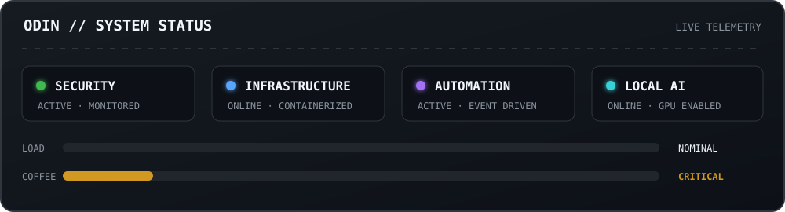
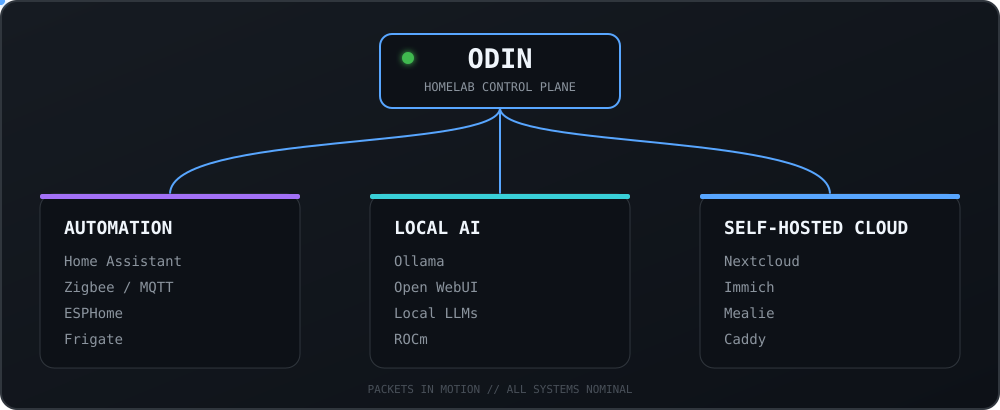
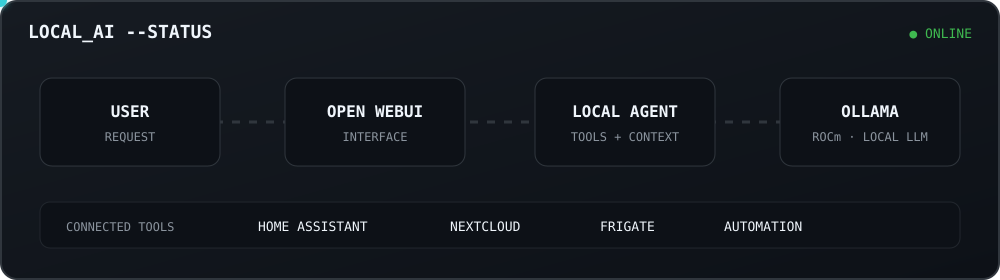

<div align="center">

# `k1k3-d3v`

### Cybersecurity · Infrastructure · Linux · Automation · Local AI


</div>

---

## `> whoami`

I'm **Enrique**, a Computer Engineer working in **cybersecurity**, with professional experience in **Data Loss Prevention (DLP)** and security in financial environments.

My work has involved analysing security alerts, improving visibility over potential data-leakage events, supporting DLP operations and building security reporting.

Outside work, I build things around **Linux, infrastructure, containers, automation, self-hosting and local AI**, while exploring **DevSecOps, Kubernetes and security engineering**.

```yaml
role: Cybersecurity Engineer

focus:
  - Data Loss Prevention
  - Linux & Infrastructure
  - Automation & Self-hosting
  - DevSecOps
  - Local AI

currently_exploring:
  - Kubernetes
  - Security Engineering
  - Local AI
  - Godot

homelab: Odin
```

---

## `> stack`

### Programming & scripting

<p>
  
</p>

`C` · `C++` · `Python` · `Bash` · `PowerShell`

### Systems & infrastructure

<p>
  
</p>

`Linux` · `Docker` · `Git` · `Caddy` · `Cloudflare` · `Tailscale`

### Development

<p>
  
</p>

### Homelab & automation

`Home Assistant` · `MQTT` · `Zigbee` · `ESPHome` · `Frigate`

### Local AI

`Ollama` · `Open WebUI` · `Local LLMs` · `ROCm`

---

## `> system_status`

<p align="center">
  
</p>

---

## `> cybersecurity`

I have professional experience working with **Data Loss Prevention**, security alerts and the protection of sensitive information in financial environments.

| Data protection | Security engineering |
|:--|:--|
| Data Loss Prevention | Linux & containers |
| Sensitive-data protection | Security automation |
| DLP alert analysis | DevSecOps |
| Security monitoring & reporting | Infrastructure & self-hosting |

---

## `> project_odin`

**Odin** is my personal homelab and automation platform: Linux, containers, home automation, self-hosting and local AI living under the same roof.

<p align="center">
  
</p>

---

## `> local_ai --status`

<p align="center">
  
</p>

The stack runs locally on **Odin**, using **ROCm**, **Ollama** and **Open WebUI**, with integrations into services across the homelab.

---

## `> featured_projects`

🚧 **Coming soon**

I'm currently cleaning up and documenting some of my personal projects before publishing them here.

---

## `> beyond_code`

```text
🏠  Overengineering my smart home
🐧  Daily-driving Linux
🎮  Soulslikes · Metroidvanias · Roguelikes
🔐  Privacy & local-first software
🤖  Giving my GPU increasingly questionable workloads
```

---

<div align="center">

### `$ ping k1k3-d3v`

[](https://github.com/k1k3-d3v)

</div>
